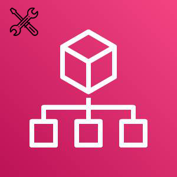

## Table of contents
* [General info](#general-info)
* [Usage](#usage)

## General info
This Tool is to export your AWS Organizations structure, SCPs to Json file and import structure, SCPs to another AWS Organization. During import and export a a log file is written so that the processes can be traced

## Tool info:
|Version |Author  | 
--- | --- |
|1.0 | David Krohn   [Linkedin](https://www.linkedin.com/in/daknhh/) - [Blog](https://globaldatanet.com/blog/author/david-krohn)|

## Usage

### Structure:
- Export: `orgtool.py -u export -f <file.json> -p AWSPROFILE `
- Import: `orgtool.py -u import -f <file.json> -p AWSPROFILE `
### SCPs:
- Export: `orgtool.py -u export-scps -f <file.json> -p AWSPROFILE`
- Import: `orgtool.py -u import-scps -f <file.json> -p AWSPROFILE`
- Validate-SCPs: `orgtool.py -u validate-scps -f <file.json> -p AWSPROFILE`
### How to use the tool with virtual env:

1. Creating virtual env: 
`python3 -m venv orgtool`

2. Activate virtual env:
`source orgtool/bin/activate`